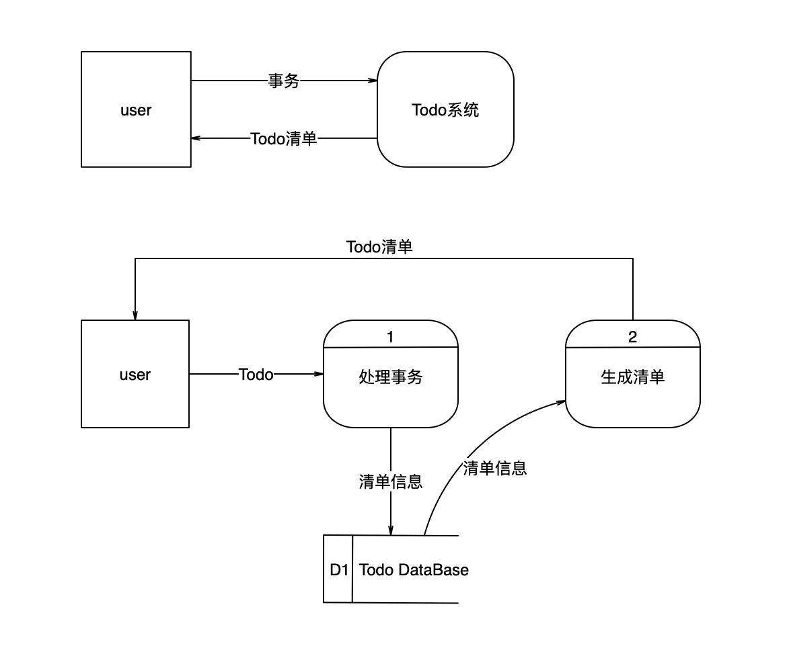

# Life

[TOC]

## 0 Todo

- [ ] .gitignore
- [ ] license
- [ ] 

## 1 概述

初步确定问题

开发一款app，最好是

* cross-platform
  * iOS
  * Android
  * Web
* 用户可以设定计划，包括短期计划，比如每一天的日程安排和长期的计划，比如一年的安排。可以开始暂停完成任务，生成时间的表格，比如柱状图，饼状图等等。

项目计划

visualize users' time

半熟芝士

关键路径

时间分析

选择软件过程

增量

## 2 Feasibility Investigation

可行性分析

1. 做一款Todo类的移动app，可同时运行在Android和iOS平台
2. 界面、手势控制





## 3 Requirement Analysis

需求分析

清新淡雅

仪式感

## 4 High Level Design (HLD) 

概要设计 

## 5 Detailed(Detail?) Design

详细设计

## 6 实现

## 7 Maintenance

维护


2018.12.20 - 2018.12.21

## 1 Database

### 1.1 Event

| id     | content | class | startTime | endTime | repeat | note | complete |      |
| ------ | ------- | ----- | --------- | ------- | ------ | ---- | -------- | ---- |
| 时间戳 | text    |       |           |         | text   | text |          |      |
|        |         |       |           |         |        |      |          |      |

### 1.2 Class

| id     | name | priority |
| ------ | ---- | -------- |
| 时间戳 | text | number   |
|        |      |          |

### 1.3 Step

| id   | step | priority | complete |
| ---- | ---- | -------- | -------- |
|      | text | number   |          |
|      |      |          |          |


```sqlite
BEGIN TRANSACTION;

/* Create a table called NAMES */
CREATE TABLE Event(id integer PRIMARY KEY, content text, class text, startTime integer, endTime integer, repeat text, note text);

/* Create few records in this table */
INSERT INTO Event VALUES(1,'a', 1, 123456789, 987654321, '不重复', '无备注');
INSERT INTO Event VALUES(2,'b', 2, 12345678910, 10987654321, '重复', '备注');


/* Display all the records from the table */
SELECT * FROM Event;


/* Create a table called NAMES */
CREATE TABLE Class(id integer PRIMARY KEY, name text, priority text);

/* Create few records in this table */
INSERT INTO Class VALUES(1, 'A', 1);
INSERT INTO Class VALUES(2, 'B', 2);


/* Display all the records from the table */
SELECT * FROM Class;


/* Create a table called NAMES */
CREATE TABLE Step(id integer PRIMARY KEY, step text, priority text);

/* Create few records in this table */
INSERT INTO Step VALUES(1, '步骤1', 1);
INSERT INTO Step VALUES(2, '步骤1', 1);


/* Display all the records from the table */
SELECT * FROM Step;

```


- Todo class
- TodoService

```
ng generate service todo
```

- install sqlite

```
ionic cordova plugin add cordova-sqlite-storage
npm install --save @ionic-native/sqlite@beta
```

- import sqlite in `app.module.ts`
  - official document
- , todo, todoservice


- controller
- component
- page
- dependences injection
- dual-bind


```typescript
// import { TodoService } from './../todo.service';
import { Component, OnInit } from '@angular/core';

import { MenuController } from '@ionic/angular';
import { AlertController } from '@ionic/angular';

import { Todo } from './../todo';

@Component({
  selector: 'app-home',
  templateUrl: 'home.page.html',
  styleUrls: ['home.page.scss'],
})
export class HomePage implements OnInit {

  /*
  content: string;
  startTime: string;
  endTime: string;
  repeat: string;
  note: string;
  */

  currentTodo: Todo;
  currentGroup: string;
  currentTime: string;
  todos: Array<Todo>;
  groups: Array<string>;

  constructor(private menu: MenuController,
    private alertController: AlertController) { }

  ngOnInit() {
    // console.log('start to initialize and load data');

    // todo
    this.currentTodo = new Todo();

    // todos
    this.todos = [];
    // this.todos = this.todoService.retrieve();
    // console.log('todos: ', this.todos);

    // groups
    this.groups = [];
    this.groups.push('life');
    this.groups.push('study');
    this.currentGroup = 'life';
    for (const todo of this.todos) {
      if (!this.groups.includes(todo.group)) {
        this.groups.push(todo.group);
      }
    }
    // console.log('groups: ', this.groups);

    // console.log('initialize and load data successfully');
  }

  initMenu() {
    console.log('start to init menu');
    // Date = Thu Dec 27 2018 04:24:57 GMT+0800 (China Standard Time)
    // this.startTime = 2018-12-26T20:24:57.064Z
    this.currentTime = new Date(new Date().getTime() + 8 * 60 * 60 * 1000).toISOString();
    this.currentTodo.startTime = this.currentTime;
    this.currentTodo.endTime = new Date(new Date().getTime() + 8.5 * 60 * 60 * 1000).toISOString();
  }

  createTodo() {
    /*
    console.log('start to create a new todo object');
    const todo = new Todo(this.currentTime, this.content, this.currentGroup, this.startTime, this.endTime, this.repeat, this.note);
    console.log('create a new todo object successfully');
    */
    this.currentTodo.id = this.currentTime;
    this.currentTodo.group = this.currentGroup;
    this.currentTodo.isDone = false;
    this.currentTodo.isDelete = false;
    console.log('the new todo object:', this.currentTodo);
    this.todos.push(JSON.parse(JSON.stringify(this.currentTodo)));
    this.currentTodo = new Todo();
    console.log('todos: ', this.todos);
    // this.todoService.createTodo(this.currentTodo);
    this.menu.toggle('createUpdateTodo');
  }

  async createGroup() {
    console.log('start to create a new group');
    const alert = await this.alertController.create({
      header: 'Group',
      message: 'Create a new group here.',
      inputs: [
        {
          placeholder: 'Name of the new group'
        }
      ],
      buttons: [
        {
          text: 'cancel',
          role: 'cancel',
          handler: () => {
            console.log('create a new group cancel');
          }
        },
        {
          text: 'confirm',
          handler: (value) => {
            this.currentGroup = value[0];
            this.groups.push(value[0]);
            console.log('create a new group successfully');
            console.log('name of the new group: ', this.currentGroup);
          }
        }
      ]
    });
    await alert.present();
  }

  retrieveTodos() {
    // retrieve all todos
    // this.todos = this.todoService.retrieve();
  }

  updateTodo(todo: Todo) {
    console.log('start to update');
    this.currentTodo = JSON.parse(JSON.stringify(todo));
    console.log(this.currentTodo);
    this.menu.open();
  }

  deleteTodo(todo: Todo) {
    console.log('start to delete');
    this.currentTodo = todo;
    console.log(this.currentTodo);
    this.menu.open();
  }

  completeTodo() {
    console.log('start to finish');
  }
}

/*
    <ion-card-content>
      <div *ngFor="let itemEvent of data.events">
        <div *ngFor="let gitemEvent of itemGroup.events">
          <ion-item-sliding>
            <ion-item *ngIf="itemEvent.id == gitemEvent">
              <div (click)="editEvent(itemEvent)">
                {{itemEvent.content}}
              </div>
              <ion-checkbox color="light" slot="end" [(ngModel)]="itemEvent.done" (ionChange)="doneEvent(itemEvent)"></ion-checkbox>
            </ion-item>
            <ion-item-options side="start" (ionSwipe)="deleteEvent(itemEvent)">
            </ion-item-options>
            <ion-item-options side="end" (ionSwipe)="showEvent(itemEvent)">
            </ion-item-options>
          </ion-item-sliding>
        </div>
      </div>
    </ion-card-content>

*/


/*
    <ion-fab vertical="bottom" horizontal="start" slot="fixed">
      <ion-fab-button color="light">
        <ion-icon name="menu"></ion-icon>
      </ion-fab-button>
      <ion-fab-list side="top">
        <ion-fab-button>
          <ion-icon name="brush"></ion-icon>
        </ion-fab-button>
        <ion-fab-button>
          <ion-icon name="help"></ion-icon>
        </ion-fab-button>
      </ion-fab-list>
    </ion-fab>
*/

```


```html
<ion-content padding>
  <ion-card *ngFor="let group of groups">
    <ion-card-header>
      <ion-card-subtitle>
        {{group}}
      </ion-card-subtitle>
    </ion-card-header>
    <ion-card-content>
      <ion-item-sliding *ngFor="let todo of todos">
        <ion-item *ngIf="todo.group == group">
          <ion-label>{{todo.content}}</ion-label>
          <ion-checkbox [(ngModel)]="todo.isDone"></ion-checkbox>
        </ion-item>
        <ion-item-options side="start" (ionSwipe)="deleteTodo(todo)"></ion-item-options>
        <ion-item-options side="end" (ionSwipe)="updateTodo(todo)"></ion-item-options>
      </ion-item-sliding>
    </ion-card-content>
  </ion-card>

  <ion-menu side="end" swipeGesture="true" menuId="createUpdateTodo" ionWillOpen="initTime()">
    <ion-list>
      <!--content-->
      <ion-item>
        <ion-label position="floating">Todo</ion-label>
        <ion-input checked [(ngModel)]="currentTodo.content"></ion-input>
      </ion-item>

      <!--group-->
      <!--Interface can also choose "action-sheet" or "alert"-->
      <!--I prefer popover.-->
      <ion-item-sliding>
        <ion-item>
          <ion-label>Group</ion-label>
          <ion-select interface="popover" [(ngModel)]="currentGroup">
            <div *ngFor="let group of groups">
              <div *ngIf="group==currentGroup">
                <ion-select-option selected>{{group}}</ion-select-option>
              </div>
              <div *ngIf="group!=currentGroup">
                <ion-select-option>{{group}}</ion-select-option>
              </div>
            </div>
          </ion-select>
        </ion-item>
        <ion-item-options side="end" (ionSwipe)="createGroup()"></ion-item-options>
      </ion-item-sliding>


      <!--time-->
      <ion-item>
        <ion-label>Start Time</ion-label>
        <ion-datetime display-format="DDD, MMM D YYYY, H:mm" [(ngModel)]="currentTodo.startTime"></ion-datetime>
      </ion-item>
      <ion-item>
        <ion-label>End Time</ion-label>
        <ion-datetime display-format="DDD, MMM D YYYY, H:mm" [(ngModel)]="currentTodo.endTime"></ion-datetime>
      </ion-item>
      <!--repeat-->
      <!--note-->
      <ion-item>
        <ion-input placeholder="Write some reflection here." [(ngModel)]="currentTodo.note"></ion-input>
      </ion-item>
    </ion-list>
    <!--slot="fixed" cannot be put into the following line.-->
    <ion-fab vertical="bottom" horizontal="center" (click)="createTodo()">
      <ion-fab-button color="light">
        <ion-icon name="checkmark"></ion-icon>
      </ion-fab-button>
    </ion-fab>
  </ion-menu>
  <!--Don"t remove the following line.-->
  <!--Don"t remove the following line.-->
  <!--Don"t remove the following line.-->
  <!--I don"t know why but menu component does work with this line.-->
  <!--If u delete the following line, u may see the following error:-->
  <!--Menu: must have a "content" element to listen for drag events on.-->
  <ion-router-outlet main></ion-router-outlet>
</ion-content>
```

